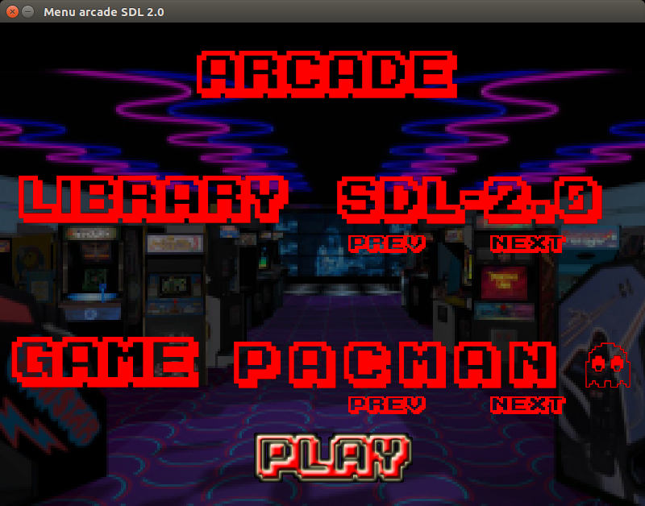
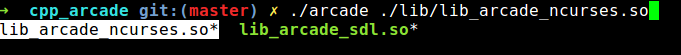
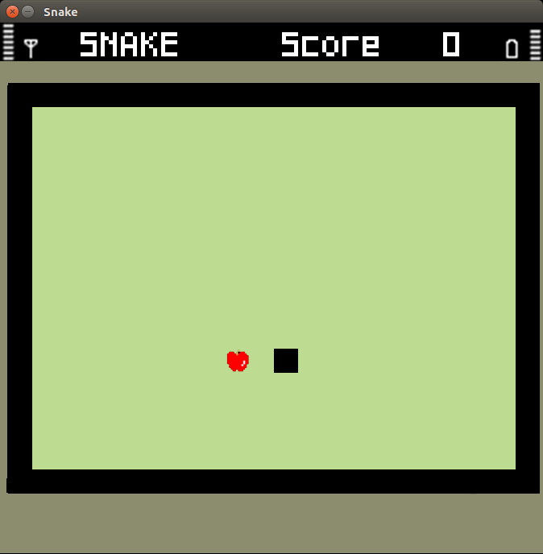

# cpp_arcade

Epitech second year project : cpp_arcade

Second c++-I module project

Deadline : 4 weeks

Beginning of the project : 05/03/2017, 23h00

Group size : 3 person

Contributor : 
  -missio_a
  -onillo_l

# cpp_arcade

Arcade is a program that lets the user choose a game to play and that keeps score. When the program starts, it must
display in separated boxes:

* All games available (In the ./games/ directory)

* All graphic libraries available (in the ./lib/ directory)

* Scores

* A field for the user to enter a name

The point of this project being to make you handle dynamic libraries at run-time, the graphic rendering as well as output must be located within a dynamic library. In order to improve your software design, you will also have to put your games in dynamic libraries. 

The body of your program must interact the same way with all of your libraries.

Each GUI available for the program must be used as a shared library that will be loaded and used dynamically by the main program. It is strictly FORBIDDEN to refer to one graphic library or another in your main program. Only your dynamic libraries can do it!

This also applies to your games

## Getting started

These instructions will allow you to obtain a copy of the operational project on your local machine for development and testing purposes.

### Prerequisites

What do you need to install the software and how to install it?

```
gcc
NCurses
SDL2
OpenGL
make
```

### Installation

Here's how to start the project on your computer

Clone and go in the directory cpp_arcade

Project compilation

```
make
```

Running project

```
./cpp_arcade ./lib_[ncurse/sdl/opengl].so
```


## Screenshot





## Build with

* [C++](https://en.wikipedia.org/wiki/C%2B%2B)

## Auteurs

* **David Munoz** - [DavidMunoz-dev](https://github.com/davidmunoz-dev)
